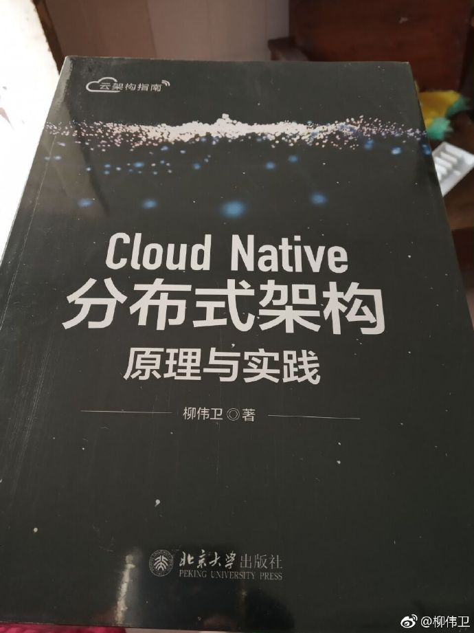

# Cloud Native Samples（Cloud Native 案例大全）/《Cloud Native 分布式架构原理与实践》示例源码

## 内容简介

Cloud Native（云原生）是以云架构为优先的应用开发模式。目前，越来越多的企业已经开始大规模地“拥抱云”——在云环境下开发应用、部署应用及发布应用等。未来，越来越多的开发者也将采用 Cloud Native 来开发应用。本书是国内 Java 领域关于 Cloud Native 的著作。

本书全面讲解了基于 Cloud Native 来构建应用需要考虑的设计原则和实现方式，涵盖 REST 设计、测试、服务注册、服务发现、安全、数据管理、消息通信、批处理、任务调度、运营、容器部署、持续发布等方面的 Cloud Native 知识。同时，书中所讲解的技术方案皆为业界主流的技术，极具前瞻性。最后，本书除了讲解 Cloud Native 的理论知识，还会在每个知识点上辅以大量的代码案例，使理论可以联系实践，具备更强的可操作性。

本书主要面向对分布式系统、微服务、Cloud Native 开发感兴趣的计算机专业的学生、软件开发人员和系统架构师。

技术版本如下：

* Apache Maven 3.5.2
* Jersey 2.27
* JUnit 4.12
* Apache CXF 3.2.4
* Spring 5.0.7.RELEASE
* Eclipse Jetty 9.4.10.v20180503
* Jackson JSON 2.9.5
* Gradle 4.5.1
* Spring Boot 2.0.3.RELEASE
* Spring Cloud Finchley.RELEASE
* Spring Security 5.0.6.RELEASE
* Spring Cloud Security 2.0.0.RELEASE
* Spring Security OAuth 2.3.3.RELEASE
* MongoDB 3.6.4
* Spring Data MongoDB 2.0.8.RELEASE
* Thymeleaf 3.0.9.RELEASE
* Thymeleaf Layout Dialect 2.2.0
* Embedded MongoDB 2.0.2
* Axon Framework 3.2
* Spring Cloud Stream Elmhurst.RELEASE
* RabbitMQ 3.7.2
* H2 Database Engine 1.4.197
* Spring Batch 4.0.1.RELEASE
* Servlet 4.0.0
* Eclipse Jetty 9.4.11.v20180605
* Jackson JSON 2.9.6
* Apache HttpClient 4.5.5
* Logback Classic Module 1.2.3
* Quartz Scheduler 2.3.0
* Spring Cloud Starter Netflix Hystrix 2.0.0.RELEASE
* Elasticsearch 6.0
* Logstash 6.0
* Kibana 6.0
* Logstash Logback Encoder 5.1
* Spring Cloud Config Client 2.0.0.RELEASE
* Spring Cloud Config Server 2.0.0.RELEASE
* Spring Boot Actuator 2.0.3.RELEASE
* Docker 17.09.1-ce-win42
* Gradle Docker 0.17.2
* ...

## 写作背景

未来越来越多的企业将会“拥抱云”。特别是对于中小企业及个人开发者而言，以云架构为优先的 Cloud Native 应用开发模式将会深入人心。Cloud Native 能帮助企业快速推出产品，同时节省成本。
笔者结合自身的云计算工作经验，以及对于 Cloud Native 的思考，将这方面的知识整理成册，内容涵盖 REST 设计、测试、服务注册、服务发现、安全、数据管理、消息通信、批处理、任务调度、运营、
容器部署、持续发布等方面的知识，希望帮助读者从理论和实践两方面来深刻理解 Cloud Native。

## Code 源码

所有示例源码，移步至<https://github.com/waylau/cloud-native-book-demos/>  `samples` 目录下
 
内容如下：

* ch02/Jersey-rest：基于 Jersey 构建 REST 服务
* ch02/cxf-rest：基于 Apache CXF 构建 REST 服务
* ch02/spring-rest：基于 Spring MVC 构建 REST 服务
* ch02/initializr-start：初始化 Spring Boot 原型
* ch02/boot-rest：基于 Spring Boot 的第一个微服务
* ch04/eureka-client、ch04/eureka-server：实现服务的注册与发现
* [ch06/mongodb-file-server](https://github.com/waylau/mongodb-file-server)：文件服务器的实现
* ch07/axon-cqrs：实现 CQRS
* ch07/cloud-stream：基于 Spring Cloud Stream 的消息通信
* ch08/jdbc-batch：使用 JDBC Batch 的例子
* ch08/spring-batch：使用 Spring Batch 的例子
* ch09/quartz-scheduler：基于 Quartz Schedule 天气预报系统
* ch10/hello-service、ch10/circuit-breaker：实现微服务的熔断机制
* ch10/elastic-log：基于 Elastic Stack 的集中化日志管理
* ch10/config-client、ch10/config-server：基于 Config 实现的配置中心
* ch10/hello-actuator：基于 Spring Boot Actuator 监测的例子
* ch11/hello-docker：使用 Docker 来构建、运行、发布微服务
* ch11/hello-heroku：发布应用到云

## 配套书籍《Cloud Native 分布式架构原理与实践》

与该源码配套的书籍《Cloud Native 分布式架构原理与实践》已经出版，内容详见全书[目录](SUMMARY.md)。

本书如有勘误，会在<https://github.com/waylau/cloud-native-book-demos/issues>上进行发布。由于笔者能力有限，时间仓促，难免错漏，欢迎读者批评指正。

您也可以上[豆瓣](https://book.douban.com/subject/30476287/)给老卫打Call。

## 如何获取本书

实体店及各大网店有售。据我所知有如下网站供应：

* [京东](https://search.jd.com/Search?keyword=%E6%9F%B3%E4%BC%9F%E5%8D%AB%20Cloud%20Native%20%E5%88%86%E5%B8%83%E5%BC%8F%E6%9E%B6%E6%9E%84%E5%8E%9F%E7%90%86%E4%B8%8E%E5%AE%9E%E8%B7%B5&enc=utf-8&wq=%E6%9F%B3%E4%BC%9F%E5%8D%AB%20Cloud%20Native%20%E5%88%86%E5%B8%83%E5%BC%8F%E6%9E%B6%E6%9E%84%E5%8E%9F%E7%90%86%E4%B8%8E%E5%AE%9E%E8%B7%B5&pvid=eb51cddd78e34081b875aad66e1f3112)
* [1号店](http://search.yhd.com/c0-0/k%25E6%259F%25B3%25E4%25BC%259F%25E5%258D%25AB%2520Cloud%2520Native%2520%25E5%2588%2586%25E5%25B8%2583%25E5%25BC%258F%25E6%259E%25B6%25E6%259E%2584%25E5%258E%259F%25E7%2590%2586%25E4%25B8%258E%25E5%25AE%259E%25E8%25B7%25B5/)
* [淘宝](https://s.taobao.com/search?q=%E6%9F%B3%E4%BC%9F%E5%8D%AB+Cloud+Native+%E5%88%86%E5%B8%83%E5%BC%8F%E6%9E%B6%E6%9E%84%E5%8E%9F%E7%90%86%E4%B8%8E%E5%AE%9E%E8%B7%B5&imgfile=&js=1&stats_click=search_radio_all%3A1&initiative_id=staobaoz_20190126&ie=utf8)
* [当当](http://search.dangdang.com/?key=%C1%F8%CE%B0%CE%C0%20Cloud%20Native%20%B7%D6%B2%BC%CA%BD%BC%DC%B9%B9%D4%AD%C0%ED%D3%EB%CA%B5%BC%F9&act=input&noresult=1)
* [亚马逊](https://www.amazon.cn/s/ref=nb_sb_noss?__mk_zh_CN=%E4%BA%9A%E9%A9%AC%E9%80%8A%E7%BD%91%E7%AB%99&url=search-alias%3Daps&field-keywords=%E6%9F%B3%E4%BC%9F%E5%8D%AB+Cloud+Native+%E5%88%86%E5%B8%83%E5%BC%8F%E6%9E%B6%E6%9E%84%E5%8E%9F%E7%90%86%E4%B8%8E%E5%AE%9E%E8%B7%B5&rh=i%3Aaps%2Ck%3A%E6%9F%B3%E4%BC%9F%E5%8D%AB+Cloud+Native+%E5%88%86%E5%B8%83%E5%BC%8F%E6%9E%B6%E6%9E%84%E5%8E%9F%E7%90%86%E4%B8%8E%E5%AE%9E%E8%B7%B5)

想低于市价得到本书？来[二手书集市](https://github.com/waylau/second-hand-books)试试看。

也可以直接关注我博客（<https://waylau.com/>）或者我的开源书（<https://waylau.com/books/>）了解更多免费咨询。

## 联系作者

您也可以直接联系我：

* 博客：https://waylau.com
* 邮箱：[waylau521(at)gmail.com](mailto:waylau521@gmail.com)
* 微博：http://weibo.com/waylau521
* 开源：https://github.com/waylau

## 其他书籍

若您对本书不感冒，笔者还写了其他方面的超过一打的书籍（可见<https://waylau.com/books/>），多是开源电子书。

本人也维护了一个[books-collection](https://github.com/waylau/books-collection)项目，里面提供了优质的专门给程序员的开源、免费图书集合。

## 开源捐赠

捐赠所得所有款项将用于开源事业！见[捐赠列表](https://waylau.com/donate/)。
